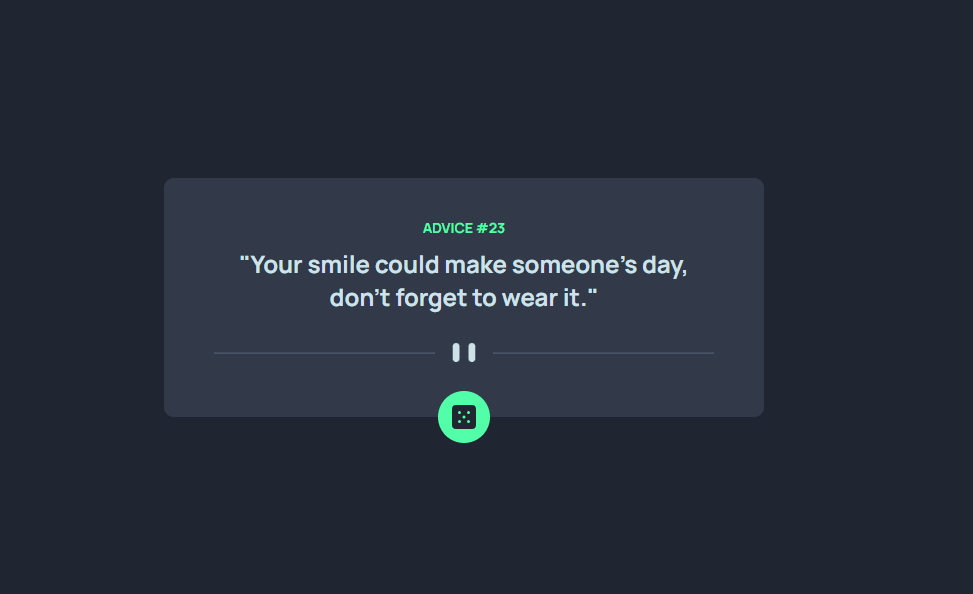

# Frontend Mentor - Advice generator app solution

This is a solution to the [Advice generator app challenge on Frontend Mentor](https://www.frontendmentor.io/challenges/advice-generator-app-QdUG-13db).

## Live Site:
- This is a [live preview](https://iabdwahab.github.io/frontend-mentor-solutions/solutions/advice-generator-app).

## Built with:

- HTML, CSS, and JavaScript [Pure].

## Features:

- Naming classes names with [BEM methadology](https://en.bem.info/methodology/).