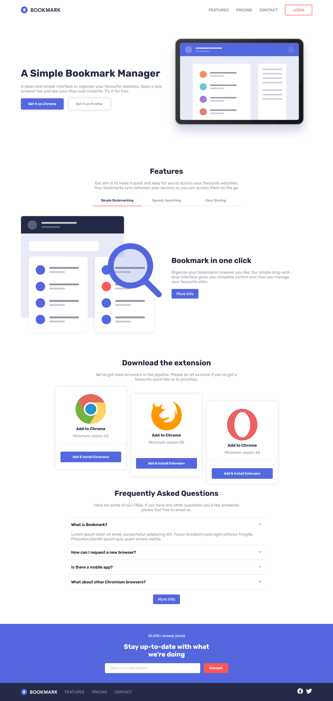

# Frontend Mentor - Bookmark landing page solution

This is a solution to the [Bookmark landing page challenge on Frontend Mentor](https://www.frontendmentor.io/challenges/bookmark-landing-page-5d0b588a9edda32581d29158).

## Live Site:
- This is a [live preview](https://iabdwahab.github.io/frontend-mentor-solutions/solutions/bookmark-landing-page).

## Built with:

- HTML, CSS, and JavaScript [Pure].

## Features:

- Responsive Design.
- Naming classes names with [BEM methadology](https://en.bem.info/methodology/).