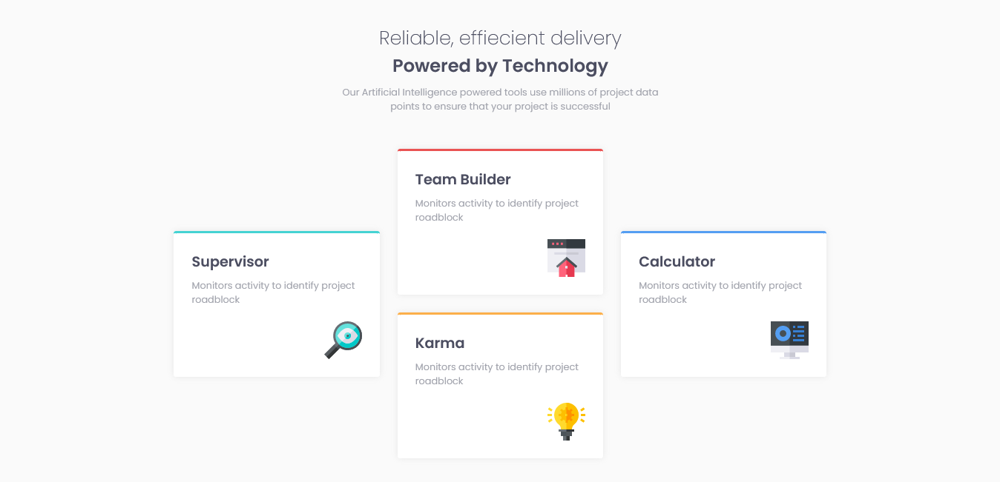

# Frontend Mentor - Four card feature section

This is a solution to the [Four card feature section challenge on Frontend Mentor](https://www.frontendmentor.io/challenges/four-card-feature-section-weK1eFYK).

## Live Site:
- This is a [live preview](https://iabdwahab.github.io/frontend-mentor-solutions/solutions/four-card-feature-section).

## Built with:

- HTML and CSS [Pure].

## Features:

- Responsive Design.
- Naming classes names with [BEM methadology](https://en.bem.info/methodology/).
