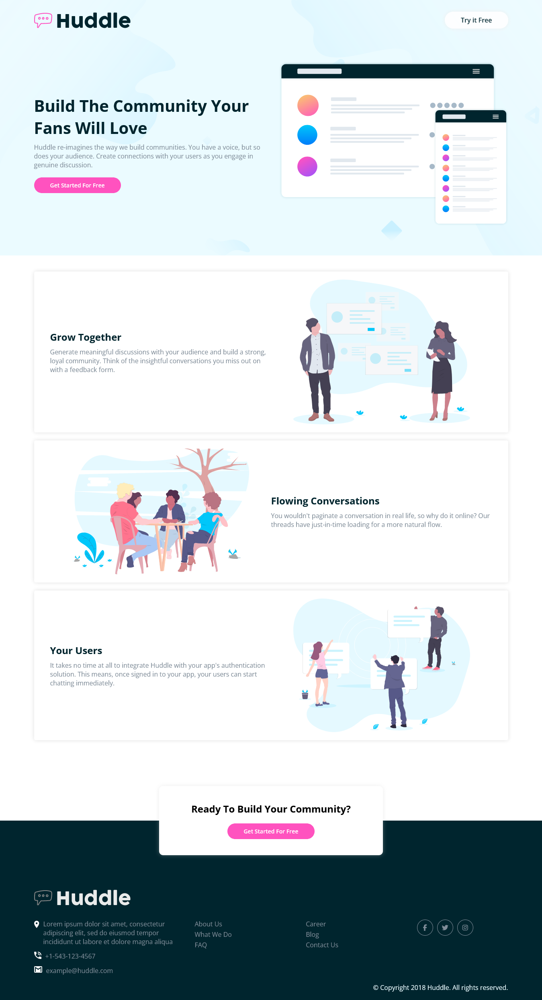

# Frontend Mentor - Huddle landing page with alternating feature blocks solution

This is a solution to the [Huddle landing page with alternating feature blocks challenge on Frontend Mentor](https://www.frontendmentor.io/challenges/huddle-landing-page-with-alternating-feature-blocks-5ca5f5981e82137ec91a5100).

## Live Site:
- This is a [live preview](https://iabdwahab.github.io/frontend-mentor-solutions/solutions/huddle-landing-page-with-alternating-feature-blocks).

## Built with:

- HTML, CSS [Pure].

## Features:

- Responsive Design.
- Naming classes names with [BEM methadology](https://en.bem.info/methodology/).