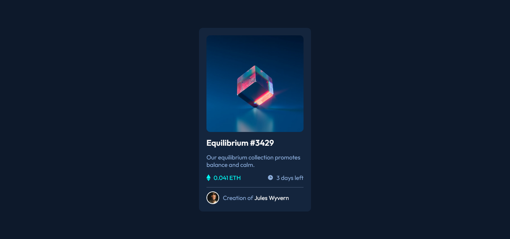

# Frontend Mentor - NFT preview card component solution

This is a solution to the [NFT preview card component challenge on Frontend Mentor](https://www.frontendmentor.io/challenges/nft-preview-card-component-SbdUL_w0U).

## Live Site:
- This is a [live preview](https://iabdwahab.github.io/frontend-mentor-solutions/solutions/nft-preview-card-component)

## Built with:

- HTML and CSS [Pure].

## Features:

- Naming classes names with [BEM methadology](https://en.bem.info/methodology/).
