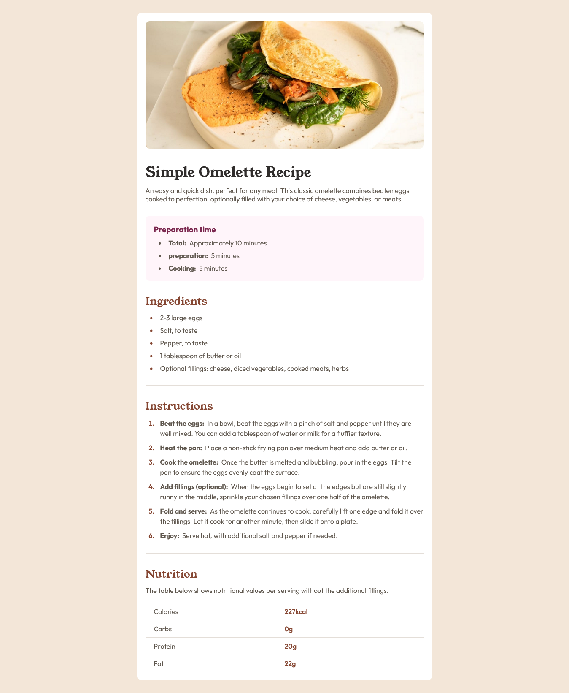

# Frontend Mentor - Recipe page solution



This is a solution to the [Recipe page challenge on Frontend    Mentor](https://www.frontendmentor.io/challenges/recipe-page-KiTsR8QQKm).

## Live Site:
- This is a [live preview](https://iabdwahab.me/frontend-mentor-solutions/solutions/recipe-page)

## Built with:

- HTML and CSS [Pure].

## Features:

- Naming classes names with [BEM methadology](https://en.bem.info/methodology/).

- This is a snippet of my HTML code:

```
<section class="ingredients-section section">
  <h2 class="ingredients-section__heading section__heading">Ingredients</h2>

  <ul class="ingredients-section__list section__list">
    <li class="list__item">2-3 large eggs</li>
    <li class="list__item">Salt, to taste</li>
    <li class="list__item">Pepper, to taste</li>
    <li class="list__item">1 tablespoon of butter or oil</li>
    <li class="list__item">Optional fillings: cheese, diced vegetables, cooked meats, herbs</li>
  </ul>
</section>
```
