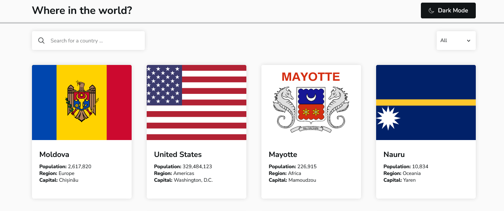

# Frontend Mentor - REST Countries API with color theme switcher

This is a solution to the [REST Countries API with color theme switcher challenge on Frontend Mentor](https://www.frontendmentor.io/challenges/rest-countries-api-with-color-theme-switcher-5cacc469fec04111f7b848ca).

## Live Site:
- This is a [live preview](https://iabdwahab.github.io/frontend-mentor-solutions/solutions/rest-countries-api-with-color-theme-switcher).

## Built with:

- HTML, CSS, and JavaScript [Pure].

## Features:

- Responsive Design.
- Naming classes names with [BEM methadology](https://en.bem.info/methodology/).
