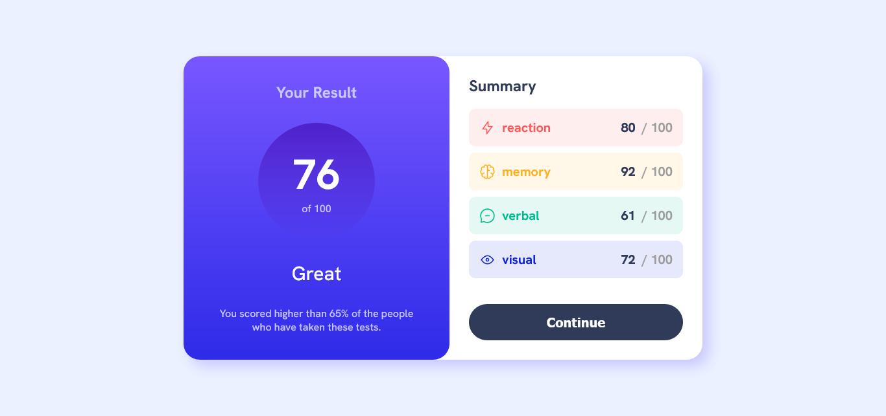

# Frontend Mentor - Recipe page solution

This is a solution to the [Results summary component challenge on Frontend Mentor](https://www.frontendmentor.io/challenges/results-summary-component-CE_K6s0maV).

## Live Site:
- This is a [live preview](https://iabdwahab.github.io/frontend-mentor-solutions/solutions/results-summary-component).

## Built with:

- HTML, CSS, and JavaScript [Pure].

## Features:

- Responsive.
- Fetch data from JSON file.
- Score Average calculated automatically based on categories scores.
- Naming classes names with [BEM methadology](https://en.bem.info/methodology/).
