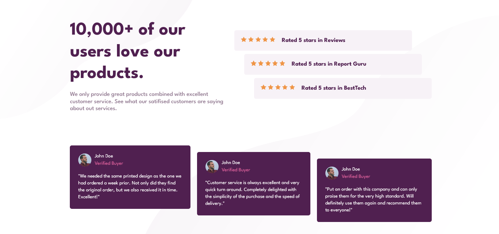

# Frontend Mentor - Social proof section

This is a solution to the [Social proof section challenge on Frontend Mentor](https://www.frontendmentor.io/challenges/social-proof-section-6e0qTv_bA).

## Live Site:
- This is a [live preview](https://iabdwahab.github.io/frontend-mentor-solutions/solutions/social-proof-section)

## Built with:

- HTML and CSS [Pure].

## Features:

- Responsive Design
- Naming classes names with [BEM methadology](https://en.bem.info/methodology/).
